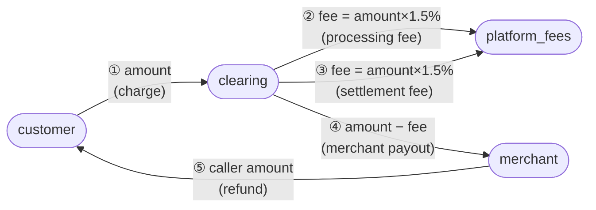

# Phase 1 — Money Map

> Observation only. No correctness judgements are made here.

---

## 1. Source files

| File | Role |
|------|------|
| `src/config.js` | Rate constants |
| `src/invoice.js` | Subtotal, VAT, charge total |
| `src/payments.js` | Charge, settle, refund orchestration |
| `src/ledger.js` | Double-entry ledger (in-memory) |

---

## 2. Constants (`src/config.js`)

| Name | Value | Used for |
|------|-------|----------|
| `VAT_RATE` | `0.075` (7.5 %) | Applied to each line-item or to the subtotal when building the charge total |
| `FEE_RATE` | `0.015` (1.5 %) | Platform processing / settlement fee |

---

## 3. Number types

Every value is a plain JavaScript `number` (IEEE-754 double-precision float).  
No integer-kobo / integer-cent representation is used anywhere.  
The only helper that limits precision is `round2` in `invoice.js`:

```js
// invoice.js line 3
const round2 = (n) => Math.round(n * 100) / 100;
```

---

## 4. Invoice calculation (`src/invoice.js`)

### 4a. `subtotal(items)` — lines 5–7
```
subtotal = Σ (item.unitPrice × item.qty)
```
- Raw float multiplication; no rounding.

### 4b. `receiptTotal(items)` — lines 9–11
```
receiptTotal = round2( subtotal × 1.075 )
```
- VAT applied **once** to the whole subtotal, then rounded to 2 d.p.
- Used for display / receipt purposes.

### 4c. `chargeTotal(items)` — lines 13–15
```
chargeTotal = Σ round2( item.unitPrice × item.qty × 1.075 )
```
- VAT applied and rounded **per line-item**, then summed.
- This is the value passed to `PaymentService.charge()` as `amount`.
- **Note:** `chargeTotal` and `receiptTotal` can differ when there are multiple items (different rounding paths).

---

## 5. Charge flow (`src/payments.js` — `charge()`, lines 10–18)

**Input:** `{ paymentId, customer, merchant, items, idempotencyKey }`

```
amount = chargeTotal(items)          // per-line-item rounded float
fee    = amount × 0.015              // raw float, never rounded
```

**Ledger postings:**

| # | From | To | Amount | Memo |
|---|------|----|--------|------|
| 1 | `customer` | `clearing` | `amount` | `charge` |
| 2 | `clearing` | `platform_fees` | `fee` | `processing fee` |

**State saved to `payments` Map:**
`{ paymentId, customer, merchant, amount, fee, idempotencyKey, refunded: 0, settled: false }`

**Return value:** `{ paymentId, amount, fee }`

---

## 6. Settle flow (`src/payments.js` — `settle()`, lines 21–29)

**Input:** `paymentId`

```
fee     = p.amount × 0.015          // recomputed from stored amount; raw float
payout  = p.amount - fee
```

**Ledger postings:**

| # | From | To | Amount | Memo |
|---|------|----|--------|------|
| 3 | `clearing` | `platform_fees` | `fee` | `settlement fee` |
| 4 | `clearing` | `merchant` | `p.amount - fee` | `merchant payout` |

**Note:** `p.fee` (computed during `charge()`) is **not reused**. `fee` is recalculated fresh from `p.amount`.

---

## 7. Refund flow (`src/payments.js` — `refund()`, lines 31–37)

**Input:** `paymentId, amount`

```
p.refunded += amount
```

**Ledger posting:**

| # | From | To | Amount | Memo |
|---|------|----|--------|------|
| 5 | `merchant` | `customer` | `amount` (caller-supplied) | `refund` |

**Notes:**
- No validation that `amount ≤ p.amount - p.refunded`.
- Refund drawn from `merchant`, not from `clearing`.
- No corresponding reversal of the `platform_fees` debit.

---

## 8. Ledger (`src/ledger.js`)

- In-memory `entries` array; no persistence.
- `post()` appends `{ ref, from, to, amount, memo, seq }` — all fields are caller-supplied floats.
- `balance(account)` sums `to` credits minus `from` debits (plain float arithmetic; no rounding).
- `accounts()` returns the set of all account names that have ever appeared in a posting.

---

## 9. Account map (all named accounts)

| Account token | Meaning |
|---------------|---------|
| `customer` | Payer / buyer (variable per payment) |
| `clearing` | Platform clearing / escrow account |
| `platform_fees` | Platform revenue account |
| `merchant` | Seller (variable per payment) |

---

## 10. End-to-end money flow (one order, happy path)

```
customer pays:         amount = chargeTotal(items)
                       fee_charge = amount × 0.015

[1] customer ──amount──────────────▶ clearing
[2] clearing ──fee_charge───────────▶ platform_fees

  ... settle() called ...
                       fee_settle = amount × 0.015   (recalculated)
                       payout     = amount − fee_settle

[3] clearing ──fee_settle───────────▶ platform_fees
[4] clearing ──payout───────────────▶ merchant
```

After a full charge + settle cycle, `clearing` balance:
```
received:   +amount           (posting 1)
paid out:   −fee_charge       (posting 2)
paid out:   −fee_settle       (posting 3)
paid out:   −payout           (posting 4)
            = amount − fee_charge − fee_settle − (amount − fee_settle)
            = −fee_charge
```
Clearing ends up negative by `fee_charge` (the charge-time fee was never replenished).

---

## 11. Flow diagram



---

*Phase 1 complete. Awaiting instruction to proceed to Phase 2 (bug hunt).*
